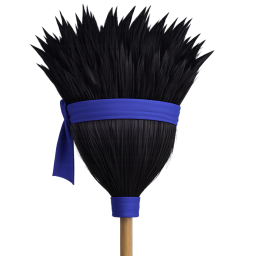

# Mugen Char Linter



Cleans up M.U.G.E.N character files by finding lines the engine silently ignores:
misspelled or made-up parameters, duplicates, garbage lines, and similar
leftovers. Useful when fixing up old or edited characters.

It only edits the character's code files (`.cns`, `.cmd` and `.air`). The
`.def` is only read, to find them. Sprites, sounds, and other media are never
touched.

This tool is made for **M.U.G.E.N**. It will warn you if a character is
made for Ikemen GO, since Ikemen-only features may look like mistakes to it.

## What it fixes

- **Unknown parameters** — lines in state controllers that M.U.G.E.N doesn't
  recognize (typos, parameters from other engines, etc.).
- **Duplicate parameters** — when the same parameter appears twice, M.U.G.E.N only
  uses the first one, so the rest are flagged.
- **Invalid values** — for a few settings with a fixed list of options (like
  `trans` or `postype`), values M.U.G.E.N doesn't accept.
- **Mismatched state numbers** — `[State]` lines that don't match the
  `[Statedef]` they belong to.
- **Command file cleanup** — unknown or duplicate entries in `.cmd` commands,
  button remaps, and defaults.
- **Animation cleanup** — duplicate animations in `.air` files, and empty
  animations that would otherwise fall through to the next one.
- **Garbage lines** — stray text that isn't valid M.U.G.E.N code.

## Is it safe?

- By default, problem lines are **commented out**, not deleted, so you can see
  and undo every change. You can also choose to delete them, or comment them
  out and tag them with the reason.
- You can save fixed copies to a separate folder, or edit in place. Editing in
  place backs up the original first (`.bak`).
- Files that don't need changes aren't touched at all.
- Text encoding (including Japanese) and line endings are kept exactly as they were.
- **Analyze** shows what would change without editing anything.
- Tagged lines from a previous run can be deleted in bulk once you're happy.

## Running from source

Requires Python 3.9 or newer, nothing else.

```text
python mugen_char_linter_gui.py              # GUI
python mugen_char_linter.py character.def    # command line
```

See `python mugen_char_linter.py --help` for command-line options. Run the
tests with `python -m unittest discover -s tests`. To build the .exe, see
[`BUILD.md`](BUILD.md).

## Notes

This is an AI-assisted project. The maintainer reviewed and tested the
resulting code and remains responsible for the project.
